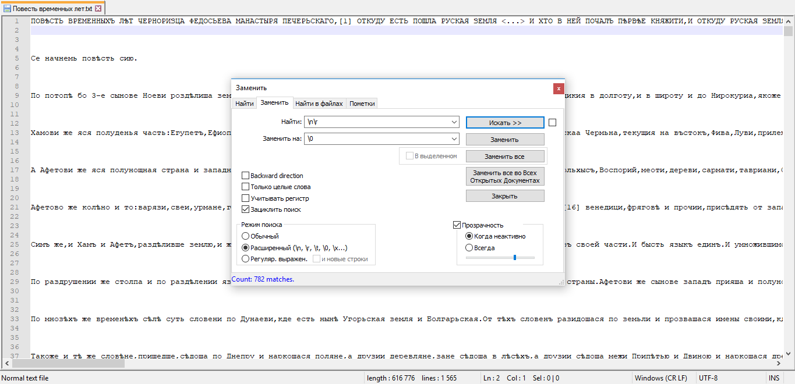
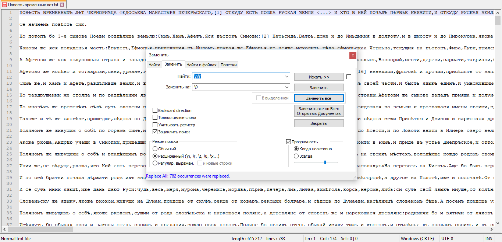
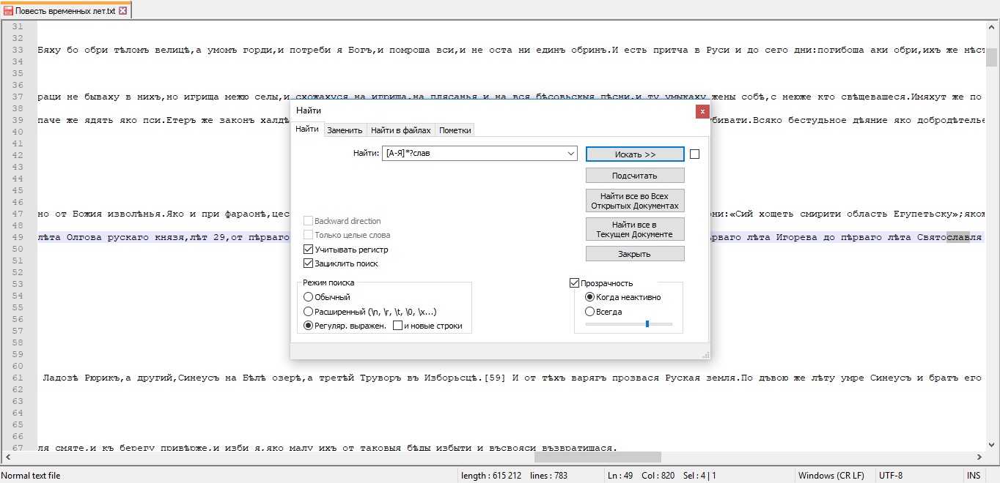

# hw8
Homework #8

#### Задание 1
Использовала регулярное выражение: `\n\r`

Заменила все вхождения на `\0`:

#### Задание 2
Использовала регулярное выражение: `[А-Я]*?слав`
Всего упоминаний о князьях нашла `653`:

#### Задание 3
Использовала регулярное выражение: `Нов.?город(.|)*?`
Всего упоминаний Новгорода нашла `59`:

